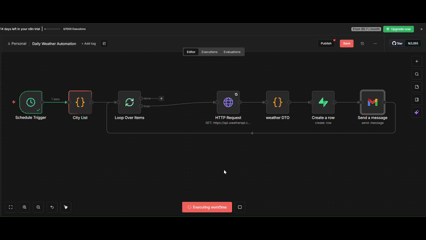

# Daily Weather Automation - n8n Workflow

## Overview
This n8n workflow automatically fetches daily weather data for multiple cities, stores it in Supabase, and sends email notifications with weather alerts.

## Demo


## Features
- ✅ Fetches weather data from WeatherAPI.com
- ✅ Processes multiple cities (London, New York, Tokyo, Paris, Sydney)
- ✅ Detects weather alerts (precipitation, heat, frost)
- ✅ Stores data in Supabase database
- ✅ Sends formatted email notifications via Gmail
- ✅ Runs daily at scheduled time
- ✅ Includes retry logic for API failures
- ✅ Additional weather metrics (UV index, visibility, pressure, etc.)

## Prerequisites

### 1. n8n Account
- Sign up at: https://n8n.io/

### 2. WeatherAPI.com Account
- Sign up at: https://www.weatherapi.com/
- Get your API key from the dashboard

### 3. Supabase Account
- Sign up at: https://supabase.com/
- Create a new project

### 4. Gmail Account
- Any Gmail account for sending emails
- Will use OAuth2 authentication

## Setup Instructions

### Step 1: Supabase Database Setup

1. Go to your Supabase dashboard
2. Navigate to **SQL Editor**
3. Run this SQL to create the table:

```
CREATE TABLE weather_logs (
  id UUID DEFAULT gen_random_uuid() PRIMARY KEY,
  run_at TIMESTAMP DEFAULT NOW(),
  city TEXT NOT NULL,
  temperature FLOAT,
  temperature_unit TEXT,
  condition TEXT,
  humidity INT,
  wind_speed FLOAT,
  alert_type TEXT,
  raw_response JSONB
);
```

4. Get your Supabase credentials:
   - Go to **Settings** → **API**
   - Copy **Project URL**: `https://YOUR_PROJECT.supabase.co`
   - Copy **anon/public key**

### Step 2: Import Workflow into n8n

1. Log into your n8n account
2. Click **"Import from File"** or go to **Workflows** → **Import**
3. Select the `daily-weather-automation.json` file
4. Click **"Import"**

### Step 3: Configure API Keys

After importing, you need to update these nodes:

#### **HTTP Request Node (Weather API)**
1. Click on the **HTTP Request** node
2. Find **Query Parameters**
3. Update the `key` parameter with your WeatherAPI.com API key

#### **Supabase Node (Create a row)**
1. Click on the **Create a row** node
2. Click on **Credential to connect with**
3. Create new credential:
   - **Host**: Your Supabase project URL
   - **Service Role Secret**: Your Supabase anon/public key
4. Save the credential

#### **Gmail Node (Send a message)**
1. Click on the **Send a message** node
2. Click on **Credential to connect with**
3. Click **"Connect my account"**
4. Follow OAuth flow to authenticate with your Gmail account
5. Grant permission to send emails
6. Update the **To** field with your email address

### Step 4: Configure Cities (Optional)

To change which cities are monitored:

1. Click on the **City List** node
2. Edit the JavaScript code:

```
const cities = ['London', 'New York', 'Tokyo', 'Paris', 'Sydney'];
// Change cities as desired
return cities.map(city => ({ city: city }));
```

### Step 5: Configure Schedule

1. Click on the **Schedule Trigger** node
2. Set your desired schedule:
   - Default: Every day at 8:00 AM
   - Adjust as needed

### Step 6: Test the Workflow

1. Click **"Execute workflow"** button (bottom of screen)
2. Watch the nodes execute
3. Verify:
   - Weather data is fetched
   - Data is saved to Supabase (check Table Editor)
   - Emails are received (check your inbox)

## Workflow Structure

```
Schedule Trigger
    ↓
City List (defines cities to monitor)
    ↓
Loop Over Items (processes each city)
    ↓
HTTP Request (fetches weather from API)
    ↓
weather DTO (processes & formats data)
    ↓
Create a row (saves to Supabase)
    ↓
Send a message (sends email)
    ↓
(loops back for next city)
```

## Alert Rules

The workflow detects and reports these weather alerts:

- **Precipitation Alert**: Rain, snow, drizzle, storm, or thunder detected
- **Heat Alert**: Temperature > 32°C (90°F)
- **Frost Alert**: Temperature < 0°C (32°F)
- **No Alert**: Normal weather conditions

## Email Format
```
- Daily Weather - London
- Temp: 14 C
- Humidity 76%
- Wind: 12 km/hr

Alert: Rain Expected Today
```

## Workflow Reference

